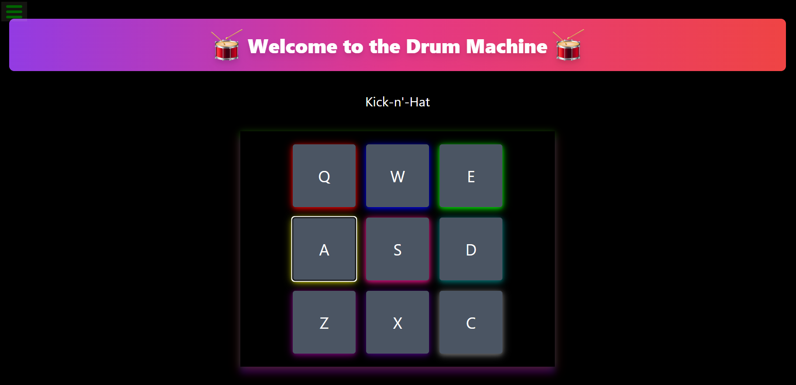

## Drum Machine
A Drum Machine built using React, Tailwind CSS, and Howler.js. This application allows users to play different drum sounds either by clicking on the buttons or by pressing the corresponding keys on their keyboard.

## Table of Contents
- Demo
- Features
- Installation
- Usage
- Technologies Used
- Future Enhancements
- Contributing

## Features
- **Responsive Design:** The Drum Machine is responsive and works well on different screen sizes.
- **Keyboard Support:** Play sounds using the keyboard keys Q, W, E, A, S, D, Z, X, and C.
- **Dynamic Display:** The name of the sound being played is displayed on the screen.
- **Smooth Audio Playback:** Powered by Howler.js for reliable and smooth audio playback.


## Live Demo


You can view a live demo of the project [here](https://quote-machine--quote-machine-p.netlify.app/)


## Installation

To run this project locally, follow these steps :

1. **Clone the repository**:
   ```bash
   git clone git@github.com:ZohalMirkhel/drum-machine.git
   ```
2. **Navigate to the project directory**:
   ```bash
   cd drum-machine
   ```

3. **Install the Required Dependencies**:
   ```bash
   npm install
   ```

4. **Run the Project:**:
   ```bash
   npm start
   ```

## Usage

1. **Play Sounds:** Click on the drum pads or press the corresponding keys on your keyboard to play sounds.
2. **View Sound Name:** The display at the top of the drum pads will show the name of the sound that is currently playing.

## Adjusting Styles

You can adjust the styling of the components by modifying the Tailwind CSS classes or adding custom styles in the App.js file.

## Contributing

If you'd like to contribute to this project, please fork the repository, make your changes, and submit a pull request. We welcome all contributions!

## Author

For any questions, feedback, or support, please contact me at:
- Email: [zohalmirkhel@gmail.com](mailto:zohalmirkhel@gmail.com)
- GitHub: [Zohal Mirkhel](https://github.com/ZohalMirkhel)
- LinkedIn: [Zohal Mirkhel](https://www.linkedin.com/in/zohal-mirkhel-840a7530a/)